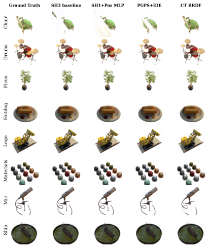

## Realtime 2DGS-based Neural Shading study



This repository includes extensions from an MSc AI thesis that replaces spherical-harmonic (SH) view-dependent colour with neural BRDF shaders to improve generalisation on specular/metallic surfaces.

### New shading modes

| Flag | Description |
|------|-------------|
| `--pos_neural_shading` | Position-conditioned MLP shader |
| `--physics_guided_shader` | Physics-guided positional shader (PGPS) |
| `--pgps_ide` | PGPS + Integrated Directional Encoding |
| `--cook_torrance_shading` | Cook-Torrance microfacet BRDF |
| `--deferred_shading` | Screen-space deferred MLP |
| `--neural_shading` | Per-Gaussian neural features |
| `--clustered_brdf_shading` | Clustered BRDF (K-means material clusters) |
| `--siren_shading` | SIREN positional shader |

For the exact commandline arguments and training details, please refer to
[REPRODUCE.md](REPRODUCE.md).

## Acknowledgements
This project is built upon [2DGS](https://github.com/hbb1/2d-gaussian-splatting). The TSDF fusion for extracting mesh is based on [Open3D](https://github.com/isl-org/Open3D). The rendering script for MipNeRF360 is adopted from [Multinerf](https://github.com/google-research/multinerf/), while the evaluation scripts for DTU and Tanks and Temples dataset are taken from [DTUeval-python](https://github.com/jzhangbs/DTUeval-python) and [TanksAndTemples](https://github.com/isl-org/TanksAndTemples/tree/master/python_toolbox/evaluation), respectively. The fusing operation for accelerating the renderer is inspired by [Han's repodcue](https://github.com/Han230104/2D-Gaussian-Splatting-Reproduce). We thank all the authors for their great repos. 

<!-- ## Citation

If you find our code or paper helps, please consider citing:

```bibtex
@inproceedings{Huang2DGS2024,
    title={2D Gaussian Splatting for Geometrically Accurate Radiance Fields},
    author={Huang, Binbin and Yu, Zehao and Chen, Anpei and Geiger, Andreas and Gao, Shenghua},
    publisher = {Association for Computing Machinery},
    booktitle = {SIGGRAPH 2024 Conference Papers},
    year      = {2024},
    doi       = {10.1145/3641519.3657428}
}
``` -->
